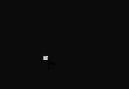

# ShapeThing

## Description
A very simple algorithm for choosing specified symbol based on his neighbors 

## Help

* Key 'R'
    * Reshape all shapes in your buffer
 * Key 'Space'
    * Add shape to list with POINT and char. Write
## Version History

* 0.1
    * Initial Release

## License

This project is licensed under the MIT License - see the LICENSE.md file for details

## Inspiration
* ThinMatrix

## Helpers
* S*******n
