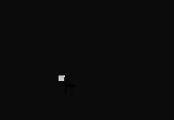

# ShapeThing

## Description
A very simple algorithm for choosing specified symbol based on his neighbors 

## Help
* Full example
```cs
            Random random = new Random();
            Console.Title = "Alpha 0.0.1";
            NormalRoads roads = new NormalRoads();

            while (true)
            {
                MouseInput mouseInput = new( POINT.Zero );
                WindowInput windowCoord = new WindowInput();
                MouseInput consoleMouseInput;

                Thread.Sleep(10);
                Console.Clear();
                windowCoord = new WindowInput { Rect = PInvokeHelper.GetWindowRectangle(Console.Title, windowCoord.Rect) };
                mouseInput = new MouseInput(PInvokeHelper.GetCursorPosition(mouseInput.CursorPosition));
                consoleMouseInput = new MouseInput
                (
                     new POINT
                     {
                         x = (mouseInput.CursorPosition.x - windowCoord.Rect.Left) / 8,
                         y = (mouseInput.CursorPosition.y - windowCoord.Rect.Top) / 18
                     }
                );
                roads.WriteRoads();
                // Write current shape on your mouse position without saving them
                Console.SetCursorPosition(consoleMouseInput.CursorPosition.x, consoleMouseInput.CursorPosition.y);
                Console.WriteLine(RoadHelper.GetRoadShape(RoadType.DefaultRoadTypes, RoadHelper.GetNeighborsList(consoleMouseInput.CursorPosition, roads.Positions)));

                if (PInvokeHelper.OnInput(ConsoleKey.Spacebar))
                    roads.SetRoad<NormalRoads>(consoleMouseInput.CursorPosition, RoadHelper.GetRoadShape(RoadType.DefaultRoadTypes, RoadHelper.GetNeighborsList(consoleMouseInput.CursorPosition, roads.Positions)))
                         .SetColor((ConsoleColor)random.Next(0,10));

                if (PInvokeHelper.OnInput(ConsoleKey.R))
                    RoadHelper.UpdateRoadChar(ref roads, RoadType.DefaultRoadTypes);
            }
```
* Key 'R'
    * Reshape all shapes in your buffer
* Key 'Space'
    * Add shape to list with POINT and char.
## Version History

* 0.1
    * Initial Release

## License

This project is licensed under the MIT License - see the LICENSE.md file for details

## Inspiration
* ThinMatrix

## Helpers
* S*******n
